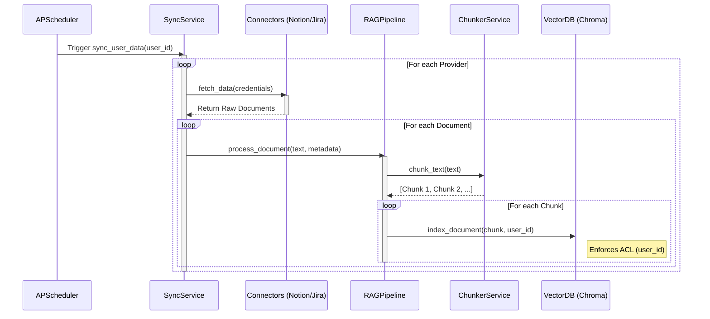
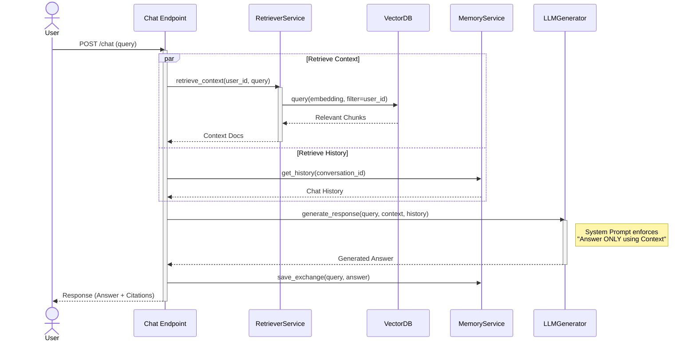

# Personal AI Knowledge Assistant

A secure, multi-source Personal AI Assistant that unifies your data from Notion, Jira, and Email into a private knowledge base. It uses Retrieval-Augmented Generation (RAG) to provide grounded, context-aware answers.

## Architecture Overview

The system is built on a micro-service architecture (monolith deployment) using FastAPI. It strictly enforces Access Control Lists (ACLs) at every layer to ensure data isolation between users.

### Key Components

1.  **Connectors**: Fetch data from external sources (Notion, Jira, Email).
2.  **RAG Pipeline**: Cleans, chunks, and indexes data into a Vector Database.
3.  **Vector DB**: Stores embeddings with strict metadata (user_id, source).
4.  **Retriever**: Semantically searches for relevant context.
5.  **Memory Service**: Manages conversation history.
6.  **LLM Generator**: Synthesizes answers using retrieved context and history.

---

## Workflows & Service Interactions

### 1. Data Ingestion Pipeline (Sync)

This workflow runs periodically (via Scheduler) or manually to keep the knowledge base up-to-date.



**Interaction Details:**

1.  **Scheduler** triggers the `SyncService` for a specific user.
2.  **SyncService** retrieves encrypted credentials and calls the appropriate **Connector**.
3.  **Connector** fetches raw data (pages, tickets, emails) and normalizes it.
4.  **RAGPipeline** takes the raw text, sanitizes it (PII masking), and passes it to the **ChunkerService**.
5.  **ChunkerService** splits the text into semantically meaningful chunks (recursive character split).
6.  **VectorDB** indexes each chunk, tagging it with `user_id` and `source_url` to ensure security and traceability.

---

### 2. Chat & Retrieval Pipeline (Query)

This workflow handles user questions, retrieving context and generating an answer.



**Interaction Details:**

1.  **User** sends a query via the API.
2.  **Chat Endpoint** orchestrates the flow.
3.  **Retriever** converts the query to a vector and searches the **VectorDB**, strictly filtering by `user_id`.
4.  **MemoryService** fetches the recent conversation history to allow follow-up questions.
5.  **LLMGenerator** constructs a prompt containing the System Instruction, History, Retrieved Context, and the User Query. It sends this to the LLM (Gemini).
6.  **LLM** generates a grounded response.
7.  **MemoryService** saves the new user query and assistant response.
8.  **API** returns the answer along with the source citations (URLs) to the user.

---

## Setup & Deployment

### Prerequisites

-   Python 3.10+
-   `GEMINI_API_KEY` (for LLM)
-   `SECRET_KEY` (for Auth)

### Installation

```bash
pip install -r requirements.txt
```

### Running the App

```bash
uvicorn app.main:app --reload
```

### API Documentation

Visit `http://localhost:8000/docs` for the interactive Swagger UI.
