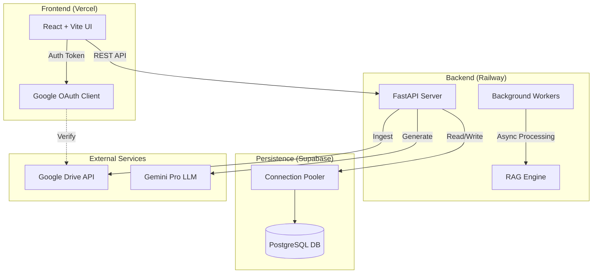
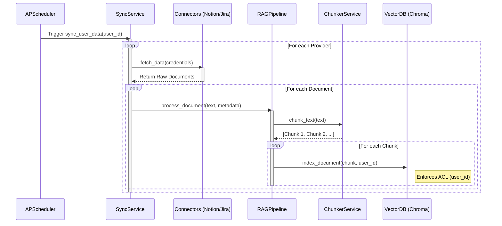
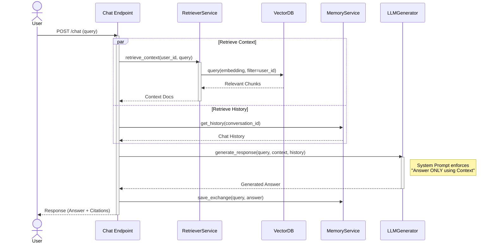

# Personal AI Knowledge Assistant

A secure, multi-source Personal AI Assistant that unifies your data from Notion, Jira, and Email into a private knowledge base. It uses Retrieval-Augmented Generation (RAG) to provide grounded, context-aware answers.

## System Architecture

The system follows a modern **Split Deployment Architecture**, separating the frontend and backend for scalability and performance.



### Key Components

1.  **Frontend (Vercel)**: A responsive React application built with Vite and TailwindCSS. It handles user interactions, file uploads, and chat visualization.
2.  **Backend (Railway)**: A stateless FastAPI service. It manages authentication, orchestrates the RAG pipeline, and communicates with the LLM.
3.  **Database (Supabase)**: A managed PostgreSQL database for storing user profiles, conversation history, and document metadata.
4.  **Vector Store**: ChromaDB (running within the backend container or separately) for storing document embeddings.
5.  **AI Engine**: Google Gemini Pro for generating grounded responses.

---

## Workflows & Service Interactions

### 1. Data Ingestion Pipeline (Sync)

This workflow runs periodically (via Scheduler) or manually to keep the knowledge base up-to-date.



**Interaction Details:**

1.  **Scheduler** triggers the `SyncService` for a specific user.
2.  **SyncService** retrieves encrypted credentials and calls the appropriate **Connector**.
3.  **Connector** fetches raw data (pages, tickets, emails) and normalizes it.
4.  **RAGPipeline** takes the raw text, sanitizes it (PII masking), and passes it to the **ChunkerService**.
5.  **ChunkerService** splits the text into semantically meaningful chunks (recursive character split).
6.  **VectorDB** indexes each chunk, tagging it with `user_id` and `source_url` to ensure security and traceability.

---

### 2. Chat & Retrieval Pipeline (Query)

This workflow handles user questions, retrieving context and generating an answer.



**Interaction Details:**

1.  **User** sends a query via the API.
2.  **Chat Endpoint** orchestrates the flow.
3.  **Retriever** converts the query to a vector and searches the **VectorDB**, strictly filtering by `user_id`.
4.  **MemoryService** fetches the recent conversation history to allow follow-up questions.
5.  **LLMGenerator** constructs a prompt containing the System Instruction, History, Retrieved Context, and the User Query. It sends this to the LLM (Gemini).
6.  **LLM** generates a grounded response.

# Personal AI Knowledge Assistant

A secure, multi-source Personal AI Assistant that unifies your data from Notion, Jira, and Email into a private knowledge base. It uses Retrieval-Augmented Generation (RAG) to provide grounded, context-aware answers.

## System Architecture

The system follows a modern **Split Deployment Architecture**, separating the frontend and backend for scalability and performance.


### Key Components

1.  **Frontend (Vercel)**: A responsive React application built with Vite and TailwindCSS. It handles user interactions, file uploads, and chat visualization.
2.  **Backend (Railway)**: A stateless FastAPI service. It manages authentication, orchestrates the RAG pipeline, and communicates with the LLM.
3.  **Database (Supabase)**: A managed PostgreSQL database for storing user profiles, conversation history, and document metadata.
4.  **Vector Store**: ChromaDB (running within the backend container or separately) for storing document embeddings.
5.  **AI Engine**: Google Gemini Pro for generating grounded responses.

---

## Workflows & Service Interactions

### 1. Data Ingestion Pipeline (Sync)

This workflow runs periodically (via Scheduler) or manually to keep the knowledge base up-to-date.


**Interaction Details:**

1.  **Scheduler** triggers the `SyncService` for a specific user.
2.  **SyncService** retrieves encrypted credentials and calls the appropriate **Connector**.
3.  **Connector** fetches raw data (pages, tickets, emails) and normalizes it.
4.  **RAGPipeline** takes the raw text, sanitizes it (PII masking), and passes it to the **ChunkerService**.
5.  **ChunkerService** splits the text into semantically meaningful chunks (recursive character split).
6.  **VectorDB** indexes each chunk, tagging it with `user_id` and `source_url` to ensure security and traceability.

---

### 2. Chat & Retrieval Pipeline (Query)

This workflow handles user questions, retrieving context and generating an answer.


**Interaction Details:**

1.  **User** sends a query via the API.
2.  **Chat Endpoint** orchestrates the flow.
3.  **Retriever** converts the query to a vector and searches the **VectorDB**, strictly filtering by `user_id`.
4.  **MemoryService** fetches the recent conversation history to allow follow-up questions.
5.  **LLMGenerator** constructs a prompt containing the System Instruction, History, Retrieved Context, and the User Query. It sends this to the LLM (Gemini).
6.  **LLM** generates a grounded response.
7.  **MemoryService** saves the new user query and assistant response.
8.  **API** returns the answer along with the source citations (URLs) to the user.

---

## Setup & Deployment

### Prerequisites

-   **Docker & Docker Compose** (for local dev)
-   **Supabase Account** (for database)
-   **Google Cloud Project** (for OAuth & Drive API)
-   **Gemini API Key**

### Local Development (Docker)

1.  **Clone the repository**:

    ```bash
    git clone https://github.com/SanketBaviskar/personal_ai_assistant.git
    cd personal_ai_assistant
    ```

2.  **Configure Environment Variables**:

    -   Create `backend/.env` (see `backend/.env.example`)
    -   Create `frontend/.env` (see `frontend/.env.example`)

3.  **Run with Docker Compose**:
    ```bash
    docker-compose up --build
    ```
    -   Frontend: `http://localhost:5173`
    -   Backend: `http://localhost:8000`

### Production Deployment

#### 1. Database (Supabase)

-   Create a new project.
-   Use the **Session Pooler** connection string (Port 6543) for the backend.
-   Run `backend/init_cloud_db.py` to create tables.

#### 2. Backend (Railway)

-   Connect GitHub repo.
-   Set Root Directory to `/backend`.
-   Add variables: `DATABASE_URL`, `GOOGLE_CLIENT_ID`, `GOOGLE_CLIENT_SECRET`, `GEMINI_API_KEY`.

#### 3. Frontend (Vercel)

-   Connect GitHub repo.
-   Set Root Directory to `/frontend`.
-   Add variables: `VITE_API_URL` (Railway URL), `VITE_GOOGLE_CLIENT_ID`.
